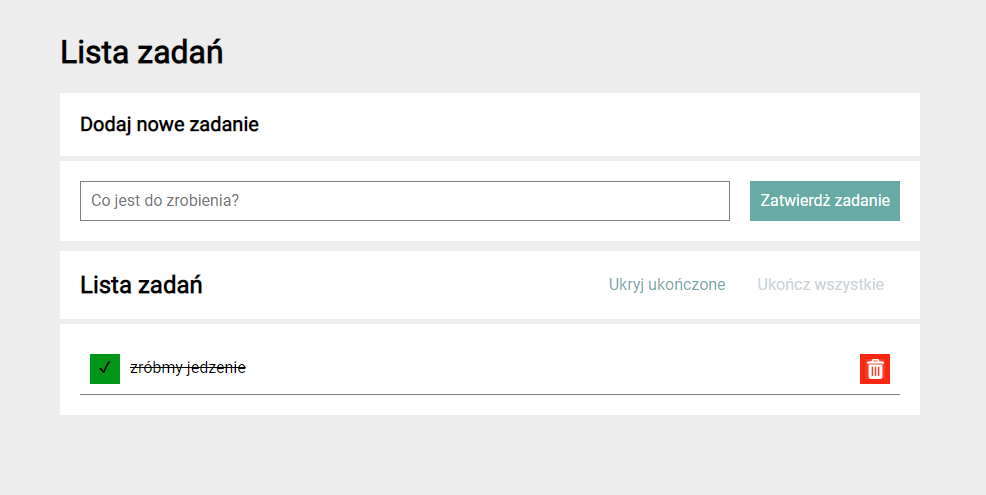

# Task List

##  Demo
https://oskars99.github.io/taskList/

## Description

A program in which we have the ability to create a list with the help of a form.
A task on the tasks list can be marked as "done" or deleted using the colored buttons.

## Update

Two buttons have been added, one to be able to hide all completed tasks. We also have the option to mark all tasks as complete with the help of the second button.
